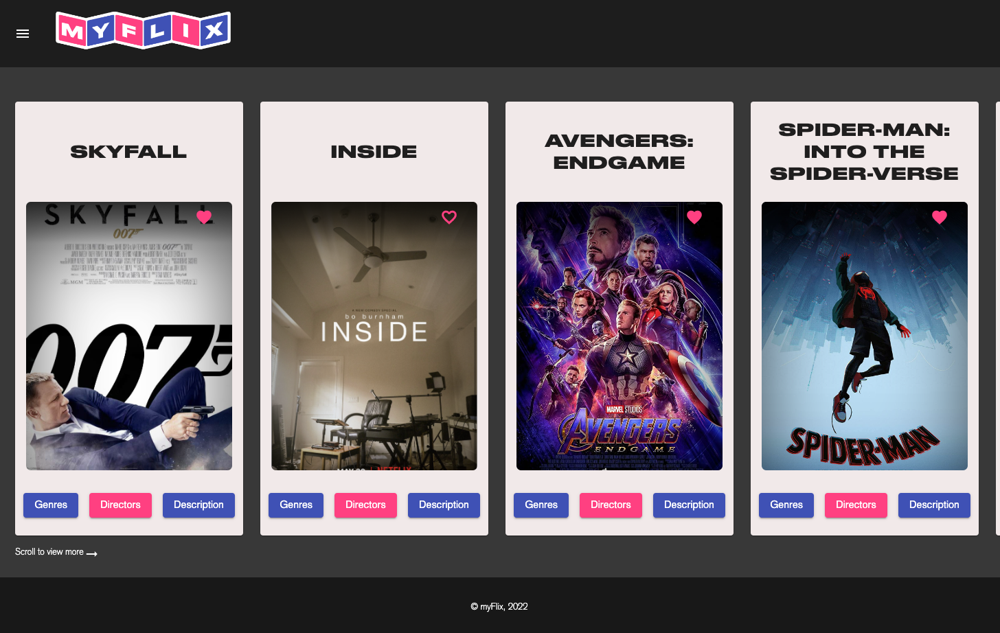
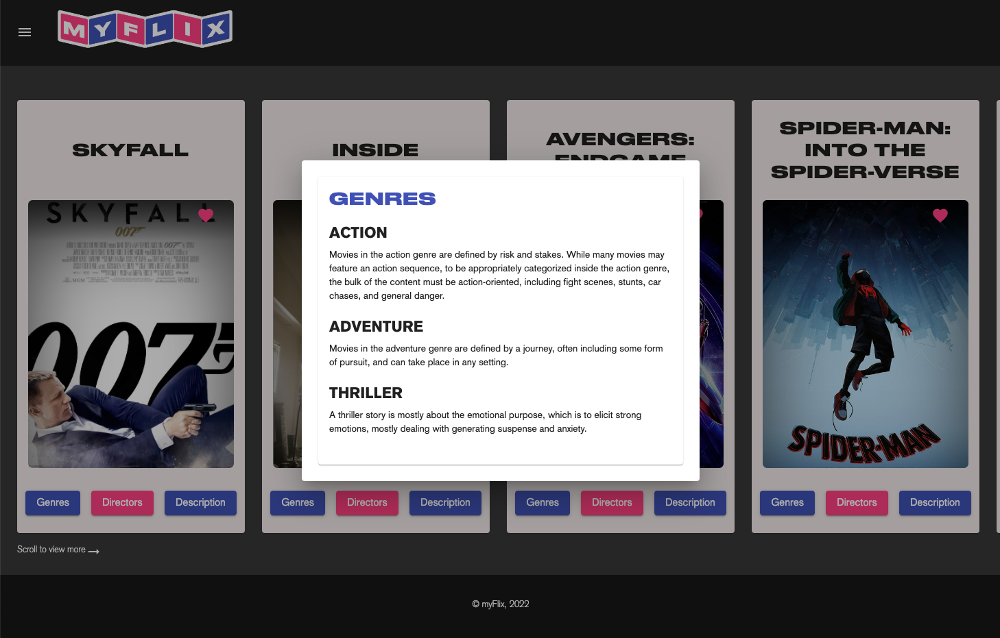
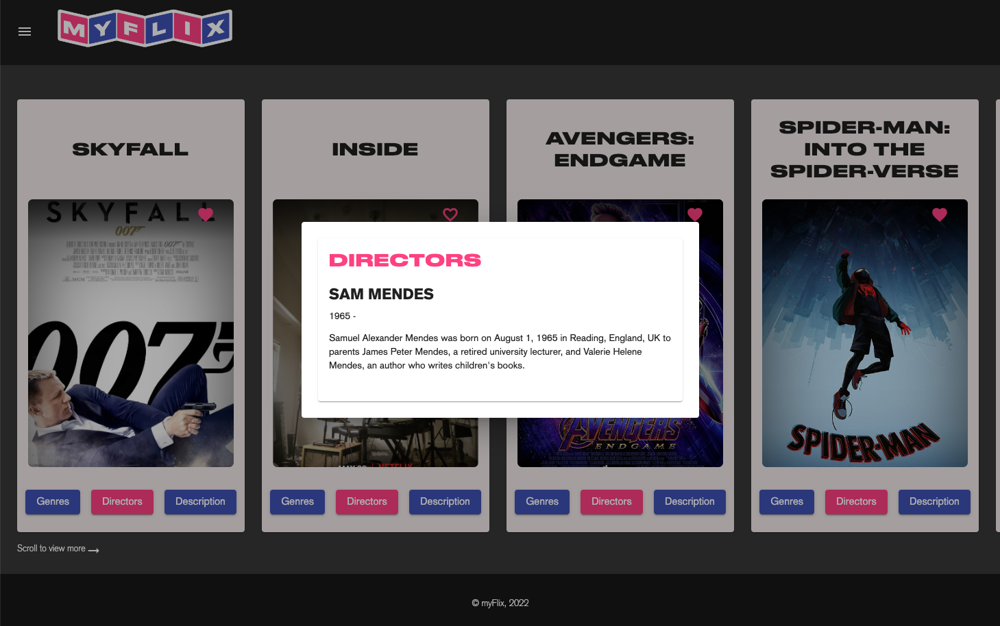
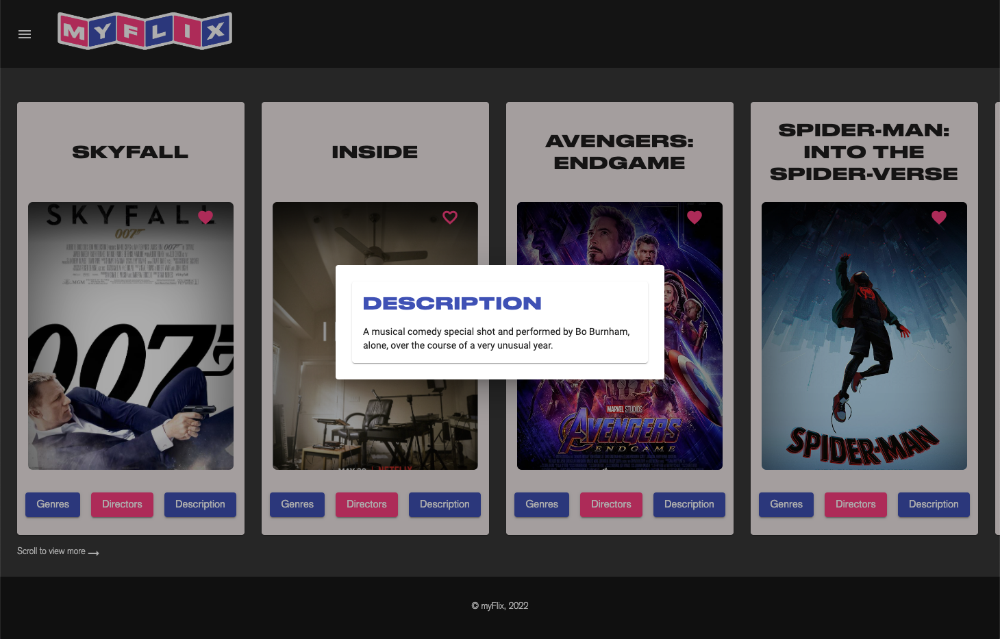
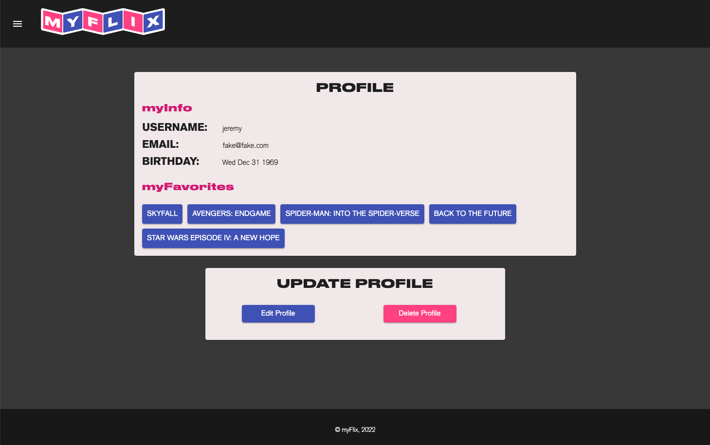
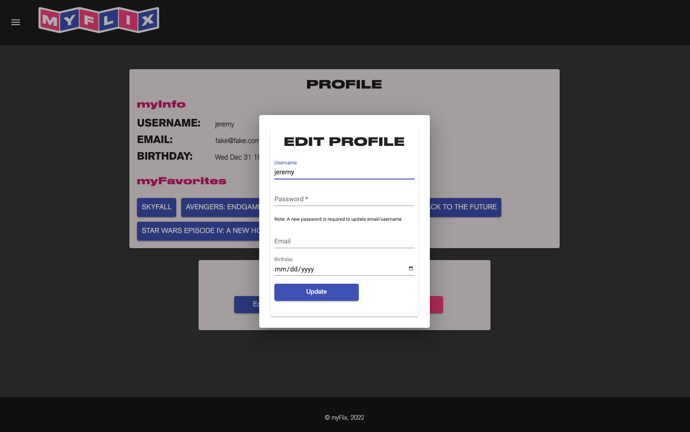
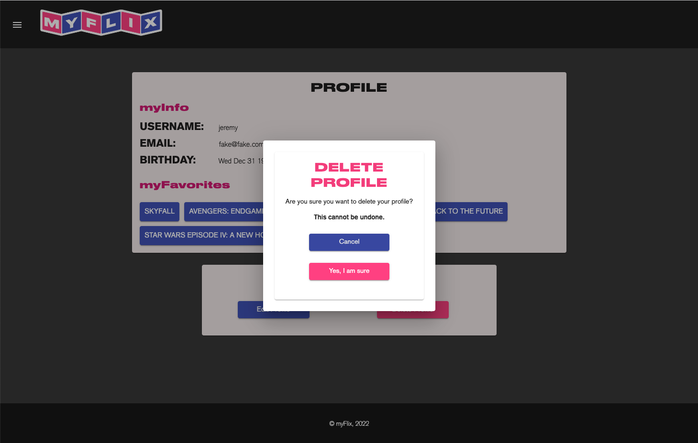

# MyFlixAngularClient

#myFlix - Angular - Achievement 6

## Technologies
### Angular
Angular is a TypeScript-based free and open-source web application framework led by the Angular Team at Google and by a community of individuals and corporations. Angular is a complete rewrite from the same team that built AngularJS.

### Material UI Angular
 Angular Material is a User Interface (UI) component library that developers can use in their Angular projects to speed up the development of elegant and consistent user interfaces. Angular Material offers you reusable and beautiful UI components like Cards, Inputs, Data Tables, Datepickers, and much more.

### TypeDoc
TypeDoc is an API documentation generator for TypeScript projects, similar to JsDoc or javadoc. 

### External API/Mongo Database
myFlix uses an external API created by Fernando and references a Mongo database.

## User Stories

- As a user, I want to be able to receive information on movies, directors, and genres so that I can learn more about movies I’ve watched or am interested in. 
	- Create a list of movies using myFlix REST API
	- Create a Movie-View
	- Create a Movie-Card
	- Create a Genre-View
	- Create a Director-View

- As a user, I want to be able to create a profile so I can save data about my favorite movies.
	- Develop a login page
	- Develop a register page
	- Develop a profile page

## Features
### See Movies’ Information
See a list of Fernando’s favorite movies, along with their descriptions, director information, and genre information. You can also add a movie to your list of favorites

### View and Edit Profile
A profile view allows you to view/edit your profile information and view your favorited movies.

### Create an Account
Not a user yet? Feel free to create an account!

## Screenshots
#### Welcome

#### Login

#### Movies

#### Details

### Profile

## Development server

Run `ng serve` for a dev server. Navigate to `http://localhost:4200/`. The application will automatically reload if you change any of the source files.

## Code scaffolding

Run `ng generate component component-name` to generate a new component. You can also use `ng generate directive|pipe|service|class|guard|interface|enum|module`.

## Build

Run `ng build` to build the project. The build artifacts will be stored in the `dist/` directory.

## Running unit tests

Run `ng test` to execute the unit tests via [Karma](https://karma-runner.github.io).

## Running end-to-end tests

Run `ng e2e` to execute the end-to-end tests via a platform of your choice. To use this command, you need to first add a package that implements end-to-end testing capabilities.

## Further help

To get more help on the Angular CLI use `ng help` or go check out the [Angular CLI Overview and Command Reference](https://angular.io/cli) page.
